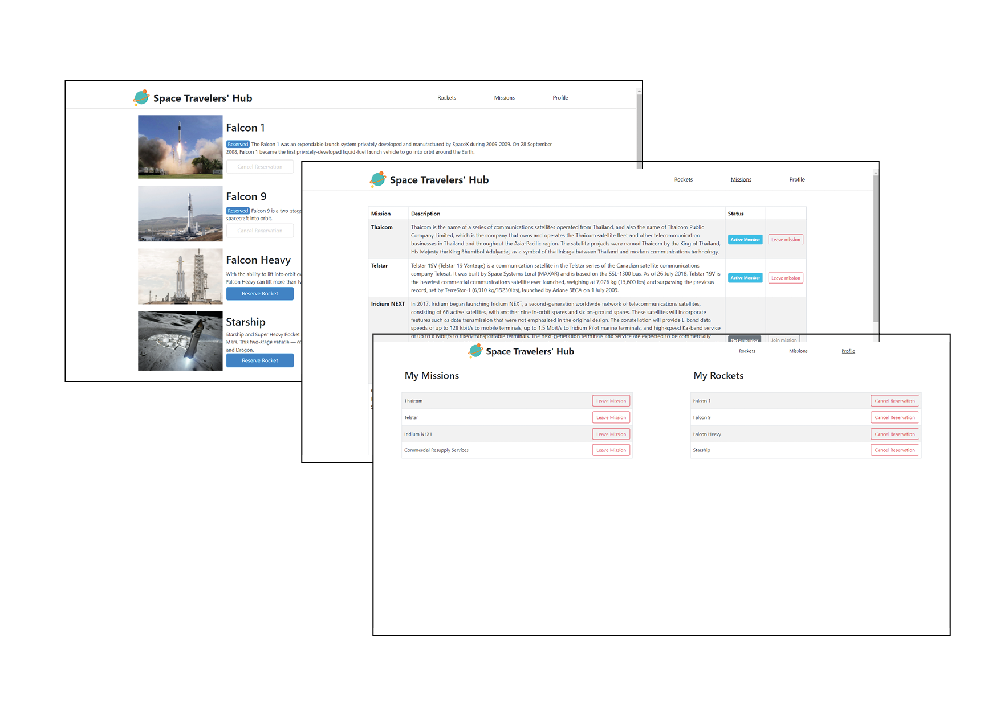

# Space Travelers' Hub
## React & Redux group project

> In this project we worked with live data from the SpaceX API and used this data to build a web application for a company that provides commercial and scientific space travel services. The application will allow users to book rockets and join selected space missions.

## Screenshot

 

## Built With

- React.js
- Redux
- CSS
- React Bootstrap
- External API

## Getting Started

To get a local copy up and running follow this simple step:

- Clone repository to your local machine: 
`git@github.com:emyrue/SpaceTravelersHub.git`

This will create a directory in the name of the project folder.

- `cd SpaceTravelersHub`
- Run `npm install` to install dependencies
- Run `npm start` to start app

You should see the app in your browser address bar at `http://localhost:3000`

## Author

👤 **Emily**

- GitHub: [@emyrue](https://github.com/emyrue)
- LinkedIn: [Emily Robertson](www.linkedin.com/in/emilyruthrobertson)

👤 **Selase**

- GitHub: [@dewslyse](https://github.com/dewslyse)

## 🤝 Contributing

Contributions, issues, and feature requests are welcome!

Feel free to check the [issues page](../../issues/).

## Show your support

Give a ⭐️ if you like this project!

## Acknowledgments

- Hat tip to anyone whose code was used
- Inspiration
- etc

## 📝 License

This project is [MIT](./LICENSE) licensed.
